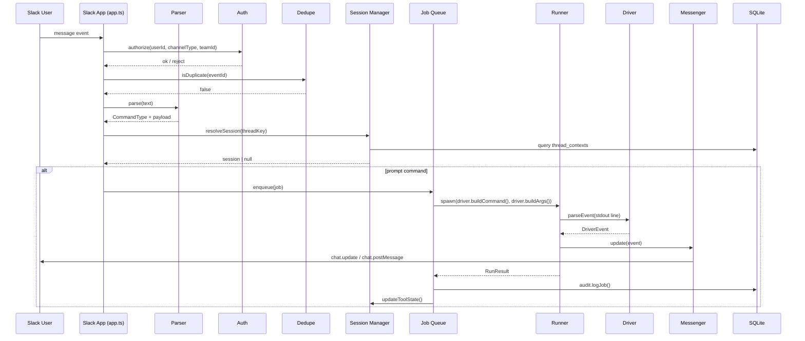

# HuskyGate - Design

## Meta

- **Project Title**: HuskyGate
- **Release**: 1.0.0
- **Design Revision**: v7.3
- **Last Updated**: 2026-03-15
- **Status**: Implemented (src/ current)

---

## 1. Overview

### Purpose & Goals
An orchestrator that uses Slack DM/threads as its UI to execute local `claude` / `codex` / `gemini` CLIs.

- Session continuity (resume/restore)
- Real-time streaming of execution status
- MCP tool approval flow (voluntary-stop method)
- Automatic MCP authentication refresh and preflight
- Session-scoped MCP server allowlists with per-node narrowing for orchestrators
- DAG-based orchestration (multi-node parallel execution)
- Webhook event triggers (external events -> automatic task/orchestration execution)
- Web dashboard (10+ tabs, chat UI, settings management)
- Audit and safe operations (challenge codes, audit logs, secret masking)

### Non-Goals
- Full TUI reproduction (operates within Slack UI constraints)
- Container isolation network control (`mode=net` is disabled)
- Multi-workspace support (assumes a single Slack workspace)

### Constraints
- Slack API rate limits (chat.update is Tier 3: ~50 req/min/channel)
- MCP OAuth headless constraints (local terminal required when interactive consent is needed)
- `better-sqlite3` Node ABI dependency (secure installs must force source builds; use `npm run deps:install`)
- Quality gates require `npm run lint`, `npm run typecheck`, and `npx vitest run --coverage` to remain green

---

## 2. Architecture Summary

### Layer Diagram

```
Slack Layer (auth/parse/messenger)          Dashboard (DB read/write + proxy)
    | command dispatch                          | HTTP proxy (runtime mutations)
Business Logic (session/queue/approval)     Server Internal API (api.ts + routes/*.ts)
    | job execution                             | enqueue / cleanup
Runner Layer (driver abstraction + child_process)
    | persistence
Data Layer (SQLite: sessions/audit/orchestrators/tasks/events)
    | event routing
Event Layer (webhook -> filter -> subscription -> triggered task/orchestrator)
```

### System Flow (Mermaid)



---

## 3. Design Documents

Detailed designs for each domain are split into the following files.

- **Architecture** — File tree, tech stack, architecture patterns — [docs/design/architecture.md](docs/design/architecture.md)
- **Data & Schema** — DB schema, data boundaries, data ownership — [docs/design/data.md](docs/design/data.md)
- **Components** — Sessions, jobs, driver interfaces, plugins, messenger — [docs/design/components.md](docs/design/components.md)
- **Slack Commands** — SSOT for all `!` bang commands, aliases, maintenance checklist — [docs/design/commands.md](docs/design/commands.md)
- **Slack Integration** — Job lifecycle, approval model, Block Kit dashboard — [docs/design/slack.md](docs/design/slack.md)
- **Tool Drivers** — Claude, Gemini, Codex driver specifications — [docs/design/drivers.md](docs/design/drivers.md)
- **Workdir & Skills** — Workdir strategy, skill seeding, file attachment, instruction files — [docs/design/workdir.md](docs/design/workdir.md)
- **Skills Management** — 組み込みスキル追加チェックリスト、変更箇所一覧 — [docs/design/skills-management.md](docs/design/skills-management.md)
- **Dashboard** — Web dashboard architecture, Dashboard API — [docs/design/dashboard.md](docs/design/dashboard.md)
- **Server Internal API** — Server API routes, authentication, module boundaries — [docs/design/server-api.md](docs/design/server-api.md)
- **Orchestrator** — DAG engine, node execution, summary, type definitions — [docs/design/orchestrator.md](docs/design/orchestrator.md)
- **Event Triggers** — Webhooks, event subscriptions, triggered tasks — [docs/design/event-triggers.md](docs/design/event-triggers.md)
- **Config & Lifecycle** — Environment variables, startup/shutdown sequence, queue — [docs/design/config.md](docs/design/config.md)
- **Security** — Authentication, authorization, secret protection, input protection — [docs/design/security.md](docs/design/security.md)
- **Testing** — lint/typecheck gates, testing strategy, coverage targets, execution methods — [docs/design/testing.md](docs/design/testing.md)
- **Operations** — Housekeeping, cross-platform — [docs/design/operations.md](docs/design/operations.md)

---

## 4. Quality Baseline

- Lint baseline: `node scripts/biome.mjs check src/` must pass without fixes
- Type baseline: `tsc --noEmit` must pass
- Strict unit coverage baseline: `npx vitest run --coverage` targets 100% for statements / branches / functions / lines
- Coverage exclusions are intentionally limited to type-only modules and integration-heavy boundaries documented in [docs/design/testing.md](docs/design/testing.md)

---

## 5. Known Limits

- `better-sqlite3` may cause test failures due to Node ABI mismatch (run `npm rebuild better-sqlite3 --build-from-source`)
- MCP OAuth depends on CLI-side implementation. Local interactive authentication is required when headless completion is not possible
- Assumes a single Slack workspace (multi-tenant not supported)

---

## 6. Acceptance Checklist

- [ ] Session commands (`!session`, `!new <tool>`, `!exit`, `!task`) work correctly
- [ ] `!` unknown command returns an error
- [ ] Auto `!exit` after 30 minutes of inactivity (including MCP auth state cleanup)
- [ ] Approval commands (`!yes/!y`, `!no/!n`) display and execute correctly
- [ ] Approval timeout (2 minutes) triggers automatic cancellation
- [ ] Detect Claude/Gemini/Codex MCP auth required and stop with guidance
- [ ] Claude MCP token auto-refresh -> auto-retry on success
- [ ] Codex MCP auth error triggers automatic authentication attempt -> auto-retry once on success
- [ ] voluntary-stop (`[MCP_TOOL_REQUEST]`) detection and approval flow (all 3 tools)
- [ ] Session-level MCP allowlists apply to Slack, Dashboard, and orchestrator runs
- [ ] Orchestrator node MCP overrides can narrow session MCP access without widening it
- [ ] `mode=write` challenge code confirmation
- [ ] `workdir=/path` challenge code confirmation + allow-root verification
- [ ] Workdir per mode + instruction seeding
- [ ] Messenger splitting (4000 chars / 12KB)
- [ ] Rate limit backoff
- [ ] Graceful shutdown (job stop + notification + DB checkpoint)
- [ ] Secret masking (logs + Slack output)
- [ ] DAG orchestration (parallel node execution, dependency resolution, summary generation)
- [ ] Webhook event triggers (receive -> filter -> task/orchestration launch)
- [ ] Dashboard all tabs working (chat, settings, orchestrator, schedule, events)
